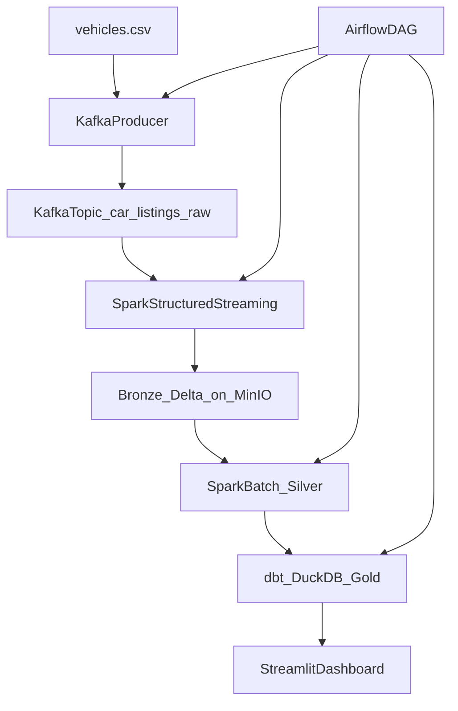

# Architecture

## End-to-end flow

## Layers (Medallion)

- **Bronze**: raw, append-only ingestion into Delta Lake on MinIO (S3-compatible)
- **Silver**: cleaned + validated + deduplicated listings (business rule filtering)
- **Gold**: dbt marts in DuckDB, optimized for analytics/dashboard queries

## Why these tools (tradeoffs)

- **MinIO**: easy local S3-compatible store (swap to AWS S3/GCS in cloud)
- **Delta Lake**: ACID + schema evolution + time travel semantics (production-like)
- **DuckDB for Gold**: simple, fast local analytical warehouse (swap to BigQuery/Snowflake/Databricks SQL)
- **Airflow**: orchestration and retry semantics (cloud analogs: MWAA/Composer)
- **Kafka + streaming**: demonstrates event streaming and near-real-time ingestion patterns

