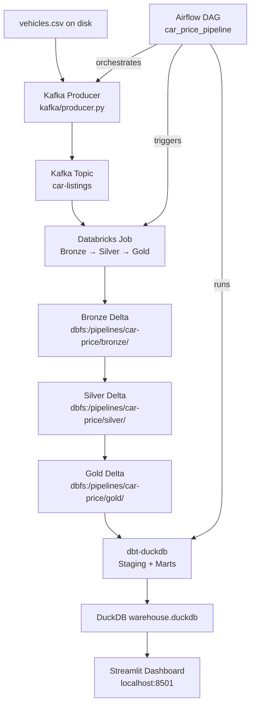
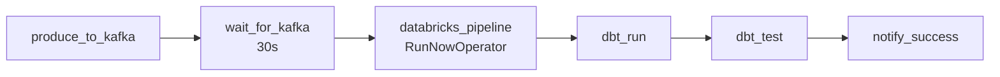

# Architecture

For current maturity, known issues, and roadmap see [PROJECT_STATUS.md](./PROJECT_STATUS.md).

## Data Flow

```mermaid
flowchart TD
    CSV[vehicles.csv on disk]
    Producer[Kafka Producer\nkafka/producer.py]
    Topic[Kafka Topic\ncar-listings]
    Databricks[Databricks Job\nBronze → Silver → Gold]
    BronzeDelta[Bronze Delta\ndbfs:/pipelines/car-price/bronze/]
    SilverDelta[Silver Delta\ndbfs:/pipelines/car-price/silver/]
    GoldDelta[Gold Delta\ndbfs:/pipelines/car-price/gold/]
    dbt[dbt-duckdb\nStaging + Marts]
    Warehouse[DuckDB warehouse.duckdb]
    Dashboard[Streamlit Dashboard\nlocalhost:8501]
    Airflow[Airflow DAG\ncar_price_pipeline]

    CSV --> Producer --> Topic
    Topic --> Databricks
    Databricks --> BronzeDelta --> SilverDelta --> GoldDelta
    GoldDelta --> dbt --> Warehouse --> Dashboard
    Airflow -->|orchestrates| Producer
    Airflow -->|triggers| Databricks
    Airflow -->|runs| dbt
```

## Airflow DAG

```mermaid
graph LR
    A[produce_to_kafka] --> B[wait_for_kafka\n30s]
    B --> C[databricks_pipeline\nRunNowOperator]
    C --> D[dbt_run]
    D --> E[dbt_test]
    E --> F[notify_success]
```

## Medallion Architecture

| Layer | Storage | Who writes | Content |
|-------|---------|-----------|---------|
| **Bronze** | Delta Lake on DBFS | Databricks notebook 01 | Raw events from Kafka, append-only, no transforms |
| **Silver** | Delta Lake on DBFS | Databricks notebook 02 | Cleaned, filtered, deduplicated listings |
| **Gold** | Delta Lake on DBFS | Databricks notebook 03 | Business aggregations: price by brand/year/condition |
| **DuckDB** | Local `warehouse.duckdb` | dbt-duckdb | Mart tables for the dashboard |

## Architecture Decisions

### Why Kafka instead of reading CSV directly?

Kafka decouples ingestion from processing. Any future source (web scraper, API, CDC feed)
can publish to the same topic without changing downstream code. The Avro schema contract
prevents silent schema drift.

### Why Databricks instead of local Spark?

Databricks manages the Spark cluster, Delta Lake, and DBFS. This eliminates the JVM/Maven
setup cost locally and matches what production data engineering teams use. The trial workspace
is free and sufficient for this dataset.

### Why DuckDB as the serving layer?

Gold Delta tables live in DBFS. dbt-duckdb reads them via `delta_scan()` and materialises
mart tables in a local DuckDB file. The Streamlit dashboard reads from DuckDB — an in-process
OLAP engine that needs no server. For a multi-user deployment, replace with Databricks SQL or
Trino.

### Why dbt instead of notebook transforms for the Gold layer?

dbt provides: version-controlled SQL, automatic lineage, column-level tests, and readable
documentation. Notebooks are better for exploratory work; dbt enforces production discipline.

## Known Limitations

- Gold layer in DBFS is not directly accessible from local DuckDB without Databricks DBFS
  mount or DBFS REST API. For local development, run notebooks locally with `local[*]` Spark.
- The pipeline is batch-oriented (`trigger(availableNow=True)`), not continuous streaming.
- Single-node Databricks cluster — adequate for 350k rows, not for production scale.
