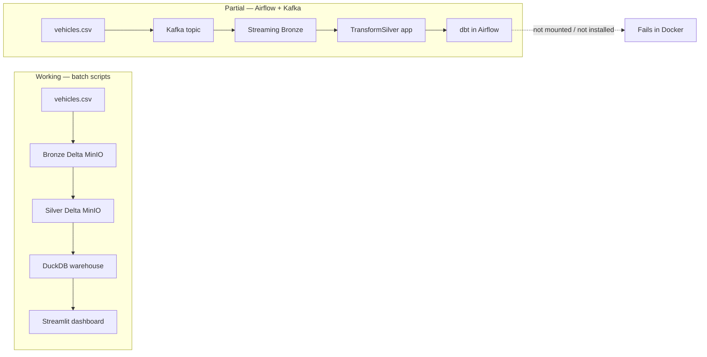

# Project status

**Last updated:** 2026-05-20  
**Repo:** Car Price Pipeline — local medallion lakehouse (CSV / Kafka → Bronze → Silver → Gold → Streamlit)

This document describes where the project stands today: what works, what is partial, and what is broken or undocumented. For architecture diagrams, see [ARCHITECTURE.md](./ARCHITECTURE.md). For the completed refactor narrative, see [`tasks/lessons.md`](../tasks/lessons.md) and [`tasks/refactor-plan.md`](../tasks/refactor-plan.md).

---

## Summary

| Area | Status |
|------|--------|
| Batch pipeline (`scripts/run_all.py`) | **Works** when Docker + dataset + env vars are in place |
| Domain / application refactor (DDD, constants, ports) | **Mostly done** (May 2026 refactor) |
| Unit + Spark tests | **Passing** locally and in CI |
| Airflow end-to-end DAG | **Incomplete** — dbt step not properly wired in Docker |
| Kafka streaming path | **Implemented** but not the default demo path; schema differs from batch bronze |
| Dashboard | **Works** after batch pipeline produces `data/warehouse.duckdb` |
| Docs / README | **Partially stale** — several links and diagrams do not match the code |

---

## What works today

### Batch “quick demo” path (recommended)

With infrastructure up and `data/raw/vehicles.csv` present:

```bash
docker compose up -d
uv sync
export SPARK_MASTER_URL="local[*]"
export MINIO_S3_ENDPOINT="http://localhost:9000"
uv run python scripts/run_all.py
```

Steps:

1. `scripts/setup_minio.py` — creates bronze / silver / gold buckets  
2. `scripts/ingest_to_bronze.py` — CSV → Delta on `s3a://bronze/listings` (renames `odometer` → `mileage`)  
3. `scripts/transform_silver.py` — Bronze → Silver Delta on `s3a://silver/listings` (uses shared `get_spark_session()` and `src/domain/constants.py`)  
4. `scripts/run_dbt.py` — `dbt run` + `dbt test` → analytics tables in `data/warehouse.duckdb`  

Dashboard (host or Docker on `:8501`) reads DuckDB marts after the pipeline has run.

### Code quality baseline

- **31 pytest tests** pass in two CI tiers: fast unit tests (`not spark`) and Spark-marked tests (`spark`).  
- **Ruff** lint and **dbt parse** run in GitHub Actions.  
- Shared filter bounds in `src/domain/constants.py` and matching dbt `vars` in `dbt/dbt_project.yml`.  
- `IListingProducer` protocol; dashboard table names whitelisted.  
- Credentials and Kafka bootstrap configurable via env vars (with local defaults).

---

## Run modes and maturity



| Mode | Entry | Maturity |
|------|--------|----------|
| Batch scripts | `scripts/run_all.py` | **Primary, tested** |
| Streamlit only | `src/interfaces/dashboard/app.py` | **Depends on prior pipeline run** |
| Airflow DAG | Trigger `car_price_pipeline` in UI | **Not production-ready** |
| Kafka UI inspection | `http://localhost:8085` | **Infra only** — producing/consuming requires DAG or manual scripts |

---

## Known problems and incomplete functionality

### P0 — Blocks or breaks real usage

#### 1. Dataset not in the repository

- Expected path: `data/raw/vehicles.csv` (Kaggle Craigslist dataset).  
- `data/` is gitignored; a fresh clone **cannot run the pipeline** until the CSV is downloaded manually.  
- `ingest_to_bronze.py` exits with a clear error if the file is missing.

#### 2. Airflow DAG cannot run dbt inside Docker

The DAG defines `dbt_run` and `dbt_test` as:

```bash
cd /opt/airflow/dbt && dbt run --profiles-dir .
```

But `docker-compose.yml` for the `airflow` service:

- Does **not** mount `./dbt` into the container  
- Does **not** install `dbt-duckdb` in the Airflow image (stock `apache/airflow:2.8.0` only)

**Result:** The “full demo” path (Airflow → Kafka → Spark → dbt) **fails at the dbt tasks** even if earlier tasks succeed. Batch dbt via `scripts/run_dbt.py` on the host still works.

#### 3. Two different Bronze schemas (batch vs streaming)

| Source | Bronze columns (relevant) | Silver consumer |
|--------|---------------------------|-----------------|
| `scripts/ingest_to_bronze.py` | Raw CSV + `mileage` rename; column **`manufacturer`** (not `make`) | `scripts/transform_silver.py` maps `manufacturer` → `make` |
| Kafka → `StreamToBronze` | Normalized JSON: **`make`**, `mileage`, etc. | `src/application/transform_silver.py` expects **`make`** already |

You cannot mix paths blindly:

- Running **batch bronze** then **Airflow `spark_silver`** (application `TransformSilver`) will fail or produce wrong results because the app layer does not rename `manufacturer`.  
- Running **Kafka bronze** then **`scripts/transform_silver.py`** may fail if bronze lacks `manufacturer`.

**Mitigation today:** Use one path end-to-end — batch scripts **or** full Airflow streaming stack (once dbt is fixed).

#### 4. Stale Delta tables on MinIO after schema changes

After the refactor (`odometer` → `mileage`, column renames), existing Silver Delta on MinIO can cause:

`DELTA_FAILED_TO_MERGE_FIELDS` or schema merge errors.

**Fix:** Delete stale paths before re-running (see [`tasks/lessons.md`](../tasks/lessons.md) — use `overwriteSchema` on intentional overwrites and wipe `silver/listings` when schema changes).

#### 5. Bronze ingest still uses `mergeSchema` on full overwrite

`scripts/ingest_to_bronze.py` uses `.mode("overwrite")` with `.option("mergeSchema", "true")`. For schema-changing overwrites, **`overwriteSchema`** is the correct option (Silver script already uses it). This can leave orphan columns in Bronze after renames.

---

### P1 — Works with caveats / design debt

#### 6. dbt `sources.yml` is unused

`dbt/models/sources.yml` declares `silver.listings`, but `stg_listings.sql` reads directly via:

```sql
SELECT * FROM delta_scan('s3://silver/listings')
```

Lineage in dbt docs does not reflect the real source. Functionally OK if MinIO is reachable from the dbt process.

#### 7. Gold layer: DuckDB warehouse vs MinIO Delta config

- `dbt/profiles.yml` targets **`../data/warehouse.duckdb`** (DuckDB).  
- Gold models set `file_format: delta` and `location_root: s3a://gold`.  

The dashboard queries **`data/warehouse.duckdb`**, not MinIO gold buckets. Whether Delta files also land on `s3a://gold` depends on dbt-duckdb behavior and has not been validated in this status pass on a clean environment. Treat **DuckDB as the serving layer**; treat **MinIO gold** as aspirational / misaligned config until verified.

#### 8. `TransformSilver` (app) vs script silver write semantics

- **Script:** `mode("overwrite")` + `overwriteSchema` — full replace.  
- **App (`DeltaWriter`):** merge/upsert on `id` when Silver table already exists.  

Different idempotency behavior between batch scripts and Airflow silver task.

#### 9. Domain year bound vs pipeline filters

- `Listing.is_valid_year()` allows years **≤ 2025**.  
- Spark filters and dbt vars cap at **`MAX_YEAR = 2024`**.  

Listings from year 2025 are dropped in Silver/Gold but considered “valid” in the domain entity.

#### 10. Docker dashboard image dependency mismatch

`Dockerfile.dashboard` pins `delta-spark==3.0.0` while the project uses **`delta-spark==3.2.0`** in `pyproject.toml`. The dashboard container only needs Streamlit + DuckDB for normal use; the mismatch matters only if Spark is invoked inside that image.

#### 11. Integration tests do not run in CI

`tests/integration/test_kafka_producer.py` is skipped unless `KAFKA_BOOTSTRAP_SERVERS` is set. There is **no automated test** against real MinIO, Spark cluster, or full pipeline in CI.

#### 12. Airflow executor and packaging

- `SequentialExecutor` — tasks run one at a time; slow for demos.  
- `PYTHONPATH=/opt/airflow` — `src` is mounted, but **dbt project and Python deps for dbt** are not part of the Airflow image.

---

### P2 — Documentation and repo hygiene

| Item | Issue |
|------|--------|
| README | References **`SECURITY.md`** and **`CONTRIBUTING.md`** — files do not exist |
| README architecture | Says Silver at `data/silver/listings` (local parquet) — **outdated**; Silver is MinIO Delta |
| README / `run_all.py` comments | Mention “Gold Delta”; serving is **DuckDB** |
| `docs/assets/` | Placeholders only (`.gitkeep`); screenshot paths in README are empty |
| `spark-thriftserver` | Running in Compose but **not used** by scripts or DAG |
| Polish comment in `docker-compose.yml` | `# ← dodaj to` on `PYTHONPATH` |

---

## CI status

GitHub Actions (`.github/workflows/ci.yml`):

| Step | What it validates |
|------|-------------------|
| `ruff check` | Python style / lint |
| `pytest -m "not spark and not integration"` | Fast unit tests |
| `pytest -m spark` | Spark session tests (JVM, no Docker services) |
| `dbt parse` | SQL/models compile only — **no** `dbt run` against MinIO |

**Not covered in CI:** end-to-end pipeline, MinIO connectivity, Kafka, Airflow DAG execution, dashboard smoke test.

---

## Component checklist

| Component | Implemented | Runnable E2E | Notes |
|-----------|-------------|--------------|-------|
| MinIO + buckets | Yes | Yes (with Docker) | `setup_minio.py` |
| Spark session factory | Yes | Yes | Single `get_spark_session()` |
| Batch Bronze ingest | Yes | Needs CSV | CSV path, not Kafka |
| Kafka producer + topic | Yes | Manual / Airflow | Default bootstrap `kafka:29092` in Docker |
| Streaming Bronze | Yes | Airflow task | Finite trigger (`availableNow` / `once`) |
| Batch Silver (script) | Yes | Yes | Canonical for `run_all` |
| App Silver (Airflow) | Yes | Only with Kafka-shaped Bronze | Merge upsert |
| dbt Silver → Gold | Yes | Host `run_dbt.py` | Needs MinIO up for `delta_scan` |
| dbt in Airflow | Declared in DAG | **No** | Missing volume + deps |
| Streamlit dashboard | Yes | After dbt | Empty DB until pipeline runs |
| Pydantic domain models | Yes | Unit tests | Used in Kafka produce path |
| Real integration tests | Stub only | Skipped in CI | Env-gated Kafka test |

---

## Environment variables (host vs Docker)

| Variable | Host default | Inside Docker network |
|----------|--------------|------------------------|
| `SPARK_MASTER_URL` | `local[*]` | `spark://spark-master:7077` (Airflow) |
| `MINIO_S3_ENDPOINT` | `http://localhost:9000` | `http://minio:9000` |
| `MINIO_ENDPOINT` (dbt DuckDB) | `localhost:9000` | Set explicitly if dbt runs in container |
| `KAFKA_BOOTSTRAP_SERVERS` | `localhost:9092` | `kafka:29092` |

First-time batch run on the host: export `SPARK_MASTER_URL` and `MINIO_S3_ENDPOINT` as in the README.

---

## Suggested next steps (priority order)

1. **Fix Airflow + dbt** — mount `./dbt` and `./data`, extend Airflow image or use a custom Dockerfile with `uv sync` / dbt-duckdb; align `MINIO_ENDPOINT` for in-container dbt.  
2. **Normalize Bronze schema** — rename `manufacturer` → `make` at ingest (batch) so batch and streaming paths share one Silver implementation.  
3. **Align Gold storage story** — either serve from DuckDB only (simplify model configs) or write and document Gold on MinIO explicitly.  
4. **Fix `ingest_to_bronze.py`** — use `overwriteSchema` on overwrite writes.  
5. **Wire dbt `source()`** — replace hardcoded `delta_scan` path with `{{ source('silver', 'listings') }}` once DuckDB source config is defined.  
6. **Add `SECURITY.md` / `CONTRIBUTING.md`** or remove links from README.  
7. **CI smoke test** (optional) — docker compose + tiny CSV fixture + `run_all.py` on PRs.  
8. **Capture screenshots** into `docs/assets/` for README demo section.

---

## Quick reference

| URL | Service |
|-----|---------|
| http://localhost:8501 | Streamlit dashboard |
| http://localhost:8080 | Airflow (admin / admin) |
| http://localhost:9001 | MinIO console |
| http://localhost:8085 | Kafka UI |
| http://localhost:8081 | Spark master UI |

**Related docs:** [ARCHITECTURE.md](./ARCHITECTURE.md) · [README.md](../README.md)
